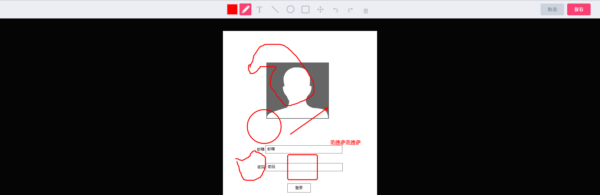
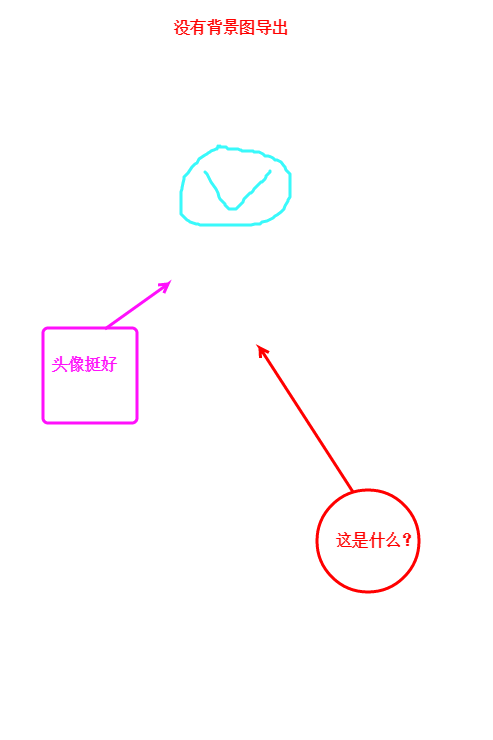
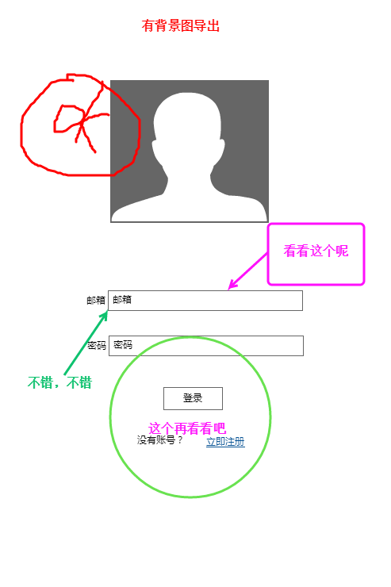

qq-Image-annotation
===================

qq Image annotation

一个angular组件，用于如QQ截图后在图片上可以进行画笔绘画、文字输入、创建圆、方形、更换颜色；可以使用undo、redo操作，也可以导出操作后的图片；组件使用cavans实现，兼容性将为ie9及以上，并使用canvas框架kineticjs进行实现，且没有使用juqery，使用纯js实现，使用较为简单实用。

安装使用：
由于是angular组件，所有需要添加相关模块，首先，添加相应的js及css文件，下载此所有文件后，如下添加至头部：
<pre>
    &lt;link rel="stylesheet" href="/stylesheets/reset.css"/&gt;
    &lt;link rel="stylesheet" href="/javascripts/review-paint/angular-paint.css"/&gt;
    &lt;script src="/javascripts/angular/angular.min.js"&gt;&lt;/script&gt;
    &lt;script src="/javascripts/angular/angular-all.js"&gt;&lt;/script&gt;
    &lt;script src="/javascripts/review/kinetic.min.5.0.1.js"&gt;&lt;/script&gt;
    &lt;script src="/javascripts/review-paint/angular-paint.js"&gt;&lt;/script&gt;
</pre>
上面是demo中文件地址，添加时，注意文件路径，且有一个图标图片文件，默认是与css在同一目录，如果需要修改，可以直接在angular-paint上直接进行修改。

在angular中使用，在angular中添加非常简单，只需要添加相应模块即可如下：
<pre>
angular.module('reviewPaint', ["ngSanitize","angular-paint"]);
</pre>

添加html,在使用时，需要添加html元素进行展示，如下：
<pre>
&lt;div id='review-paint'&gt;
    &lt;div paint img-src="test.png"&gt;&lt;/div&gt;
&lt;/div&gt;
</pre>
只需要添加如下元素即可，在子元素div中，有个paint属性及img-src，这两个是必须的，第一个是用于添加此组件指令，而img-src则用于传递需要操作的图片路径；

添加成功后，即可看到相应的界面及操作，在操作右上角有“保存”按钮，用于导出操作图片，默认是只能导出操作的相关动作的图片，不包括原图，如下图：

如果需要一同导出原图，则需要有以下添加：
1、将上面的img-src的地址与你的页面在同一域下，即不能跨域；
2、运行需要搭建一个本地服务器上运行，即不能直接本地打开，即路径不能是：“file:///”开始；
3、在上面html代码需要修改如下：
<pre>
&lt;div id='review-paint'&gt;
    &lt;div paint img-src="test.png" exportImg &gt;&lt;/div&gt;
&lt;/div&gt;
</pre>
如果有以上添加满足，则可以导出整体图片，导出结果如下：

